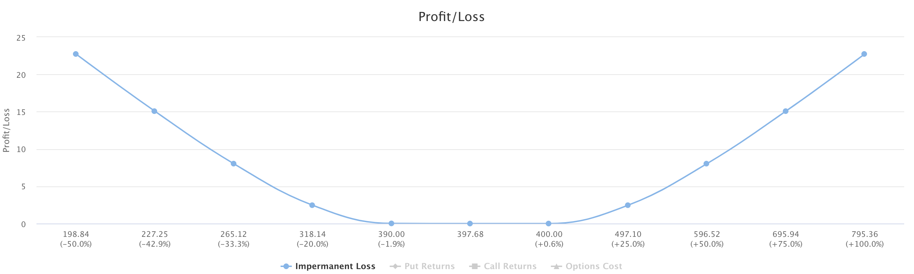
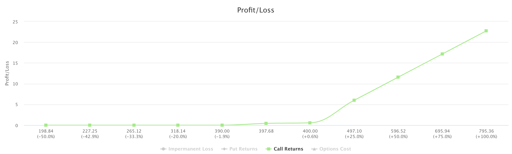
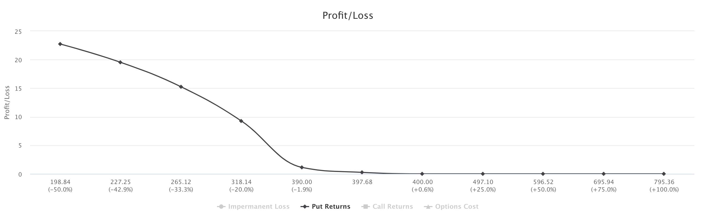
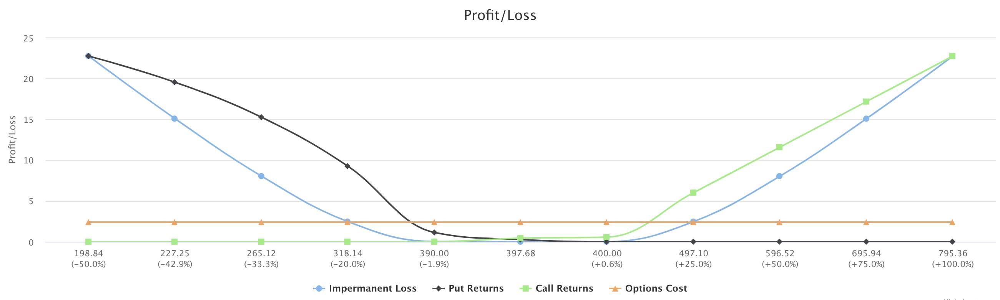
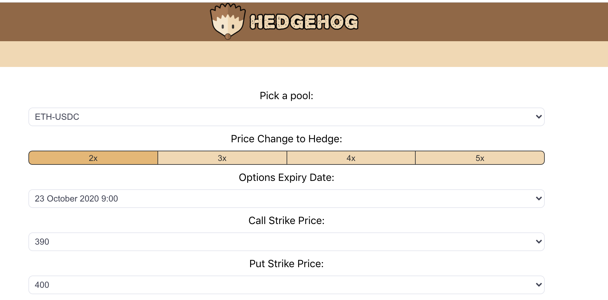

# What is HedgeHog?

Being a Liquidity Provider on a constant product AMM means you are exposed to impermanent loss. Options give you the opportunity to speculate on price change in one direction and combining two options (one in each direction - known as a straddle or strangle) allows you to hedge against impermanent loss caused by large price moves.

Hedgehog is a simple tool for helping you visualise AMM Impermanent Loss as an LP whilst hedging with decentralised options. 

Soon, it will allow you to provide liquidity to a pool and buy the options you wish to hedge in an atomic transaction.

You can access hedgehog here: https://conspyrosy.github.io/hedgehog/

# Strategy

In Uniswap, as an LP, you provide assets to a pool at a 50/50 ratio. The AMM attempts to remain balanced by using the constant product formula a * b where a and b are values of tokens in the pool. This works well in fairly stable markets, but in trending markets this has an adverse effect of "Impermanent Loss" and the more imbalanced pools get, the worse the "loss" becomes. To understand this concept more, you can read this article:

https://medium.com/@pintail/understanding-uniswap-returns-cc593f3499ef

Lets take an example of providing liquiditiy to the ETH-USDC pool with a mid price of 397.68. The following graph shows the extent of the loss as the asset ratio changes:

Below we can see the return of a 390 CALL option as price changes (ignoring any extrinsic value the option has and assuming we will exercise it). We have purposely bought enough such that (impermanent loss @ +100% = return of total CALL options bought @ +100%):

Similarly, the returns of a 400 PUT option are graphed below. We have purposely bought enough such that (impermanent loss @ -50% = return of total PUT options bought @ -50%):

Putting this all together and plotting the options cost, we get a solid visualisation of how much it will cost to be fully hedged within out desired price range:

We can use this information, alongside expected pool returns to decide whether it is worth providing liquidity and using options to hedge. For now, no expected returns are plotted as this varies wildly based on how a pool is transacted with. But, by using HedgeHog alongside any expected pool growth, it is trivial to see if pool returns outweigh the cost of the options hedge.

Hedgehog allows you to choose the available strike prices of PUTs, CALLs and the price range to hedge in the settings panel. It will automatically calculate the amount of options needed using the methodology outlined above.

If you want a better explanation of this strategy, DefiROI has made a video outlining it in much more detail: 

### Improvements (pending...)

- cost per day (pro-rata) of hedging
- user should say how much liquidity they are providing as options price vary depending on amount bought... right now we're assuming 1 unit of liquidity
- refresh uniswap mid price and option data on block updates
- smart contract to buy the options and provide liquidity to the pool
- be fully hedged at each point vs the extreme points...
- Allow user to alter amount of oTokens desired manually
- Support multiple asset pools. Right now just ETH-USDC is hardcoded due to lack of options available
- Allow an arbitrary amount of options to be placed on the graph (multiple calls and puts). This will allow for more exotic strategies e.g. butterfly spreads.
- Support other AMMs e.g. balancer, mooniswap, bancor, dodoex. Since balancer has up to 8 assets per pool it will be difficult to do anything meaningful with multi-asset pools. but for pools with only 2 assets and custom weights e.g. 98/2, this should work well.
- Fetch options from multiple sources (centralised or decentralised)

### Credits

- DefiROI for inspiring idea
- https://www.flaticon.com for the hedgehog logo